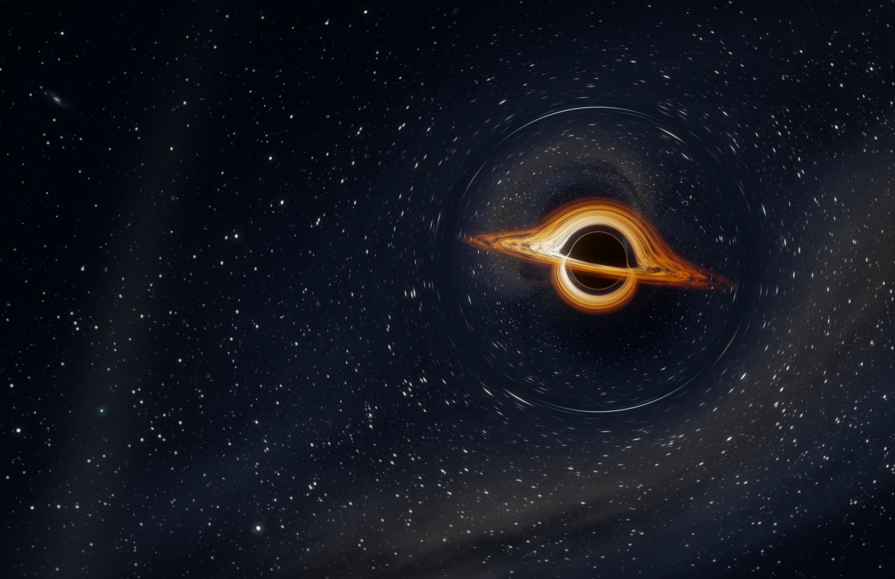
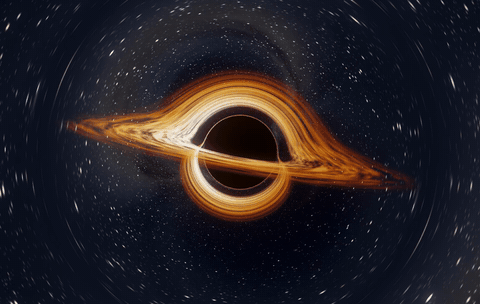
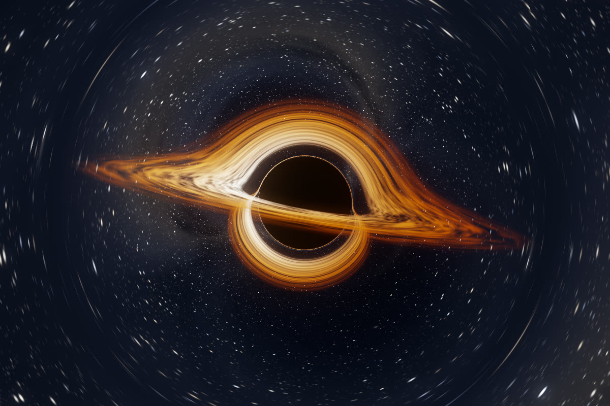
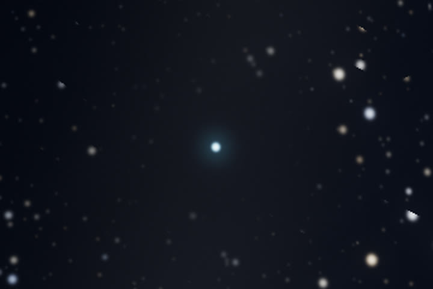

# Pale Blue Dot

A live wallpaper for macOS. A black hole bends the light of the stars behind it, the Milky Way drifts across the sky, and somewhere in the lower left sits one small pale blue dot.



I wanted a desktop that quietly reminds me how big the universe is. My first version rendered a black hole shader live in a web view, and it kept the GPU of my fanless MacBook Air at 95 to 100 percent all day. This version does the heavy work once. A Metal ray tracer renders a seamless 48 second loop, and a small native player shows it behind the desktop icons using the Mac's hardware video decoder.

<p align="center">
  
  <br>
  <sub>The loop at 8x speed</sub>
</p>

## What is in the picture

- **A black hole** with a thin accretion disk. The inner disk orbits faster than the outer disk, and the side moving toward the camera looks brighter and bluer because of Doppler beaming and gravitational redshift.
- **Gravitational lensing.** Every pixel follows a light ray through curved spacetime, so the far side of the disk shows up above and below the black hole, and background stars stream around it as the camera drifts.
- **The Milky Way**, a faint band of stars with dark dust lanes, bent into an arc where it passes behind the black hole.
- **Distant galaxies.** Each faint smudge is a whole galaxy. One small spiral sits in the upper left.
- **A pale blue dot** in a small clear patch with a faint beam of light through it. It is a nod to the photo Voyager 1 took of Earth in 1990 from about six billion kilometers away.

| Black hole | Pale blue dot |
| --- | --- |
|  |  |

## How it works

**Rendering** (`scene.metal`, `render.swift`). A Metal compute kernel traces one light ray per pixel, and four per pixel near the black hole where lensing stretches the stars. Rays follow the Schwarzschild photon equation x″ = −1.5 h² x / r⁵, integrated with leapfrog steps that shrink near the horizon. When a ray crosses the disk plane, I shade the disk with a blackbody color, a combined Doppler and gravitational shift, and turbulent noise. Rays that escape sample a procedural sky of stars, galaxies, and the Milky Way. A bloom pass built on Metal Performance Shaders and ACES tone mapping finish each frame. The frames go to ffmpeg as 16 bit RGB for hardware HEVC Main 10 encoding.

**A loop with no seam.** The camera moves on a closed path. The disk texture cannot simply repeat, because inner rings orbit faster than outer ones, so I blend two copies of the pattern one loop apart and correct the blend so its contrast stays constant. In the rendered frames, the jump from the last frame back to the first is the same size as any ordinary step between frames.

**Playback** (`wallpaper.swift`). A small AppKit app puts an `AVPlayerLayer` window on every display, just above the desktop picture and below the icons. It pauses when windows fully cover the desktop, when the displays sleep, and in Low Power Mode, and it never keeps the display awake. A launchd agent starts it at login, so only one copy ever runs.

## Performance

Measured on my MacBook Air with an M2 chip and 8 GB of memory.

| | GPU busy | CPU | Memory |
| --- | --- | --- | --- |
| My earlier live shader wallpaper | 95 to 100% | about 20% of one core | about 145 MB |
| This wallpaper, playing | about 12%, against 5% with nothing playing | about 3% of one core | about 160 MB, mostly decoded frames |
| This wallpaper, paused behind windows | no added load | 0% | same |
| Rendering the loop, once | 100% for about 3.5 minutes | | |

The video is 2880 × 1864 at 30 frames per second, 48 seconds long, and about 130 MB.

## Requirements

- macOS on Apple silicon. I built and tested it on macOS 26 with an M2 MacBook Air.
- Xcode Command Line Tools, for `swiftc`.
- ffmpeg, only for rendering (`brew install ffmpeg`).

## Setup

```sh
git clone https://github.com/danish-puri/pale-blue-dot.git
cd pale-blue-dot
./render-video.sh        # renders cosmos.mp4 and cosmos.png, about 3.5 minutes of full GPU load
./wallpaper.sh install   # builds the player and starts it now and at every login
```

To skip rendering, download `cosmos.mp4` and `cosmos.png` from the [latest release](https://github.com/danish-puri/pale-blue-dot/releases/latest) into the folder, then run `./wallpaper.sh install`.

I render the loop at 2880 × 1864, the native resolution of my display. For a different screen, change `W` and `H` at the top of `render-video.sh`. The player scales the video to fill any display either way.

## Controls

- The ✨ icon in the menu bar pauses the motion or quits the wallpaper.
- `./wallpaper.sh stop` and `./wallpaper.sh start` turn it off and on. It comes back at the next login either way.
- `./wallpaper.sh uninstall` removes the login item and sets a plain gray desktop.

## Making it your own

The look lives in `scene.metal`. The constants at the top set the camera distance (`CAM_DIST`), where the black hole sits on screen (`TARGET`), and the size of the disk (`DISK_IN`, `DISK_OUT`). The three `starLayer` calls in `sky` set how many stars there are and how bright they look. After a change, run `./render-video.sh` and then `./wallpaper.sh install`.

## Credits

The blackbody color fit comes from Tanner Helland. The name and the little blue dot come from the Voyager 1 photograph and Carl Sagan's book *Pale Blue Dot*.

## License

MIT. See [LICENSE](LICENSE).
